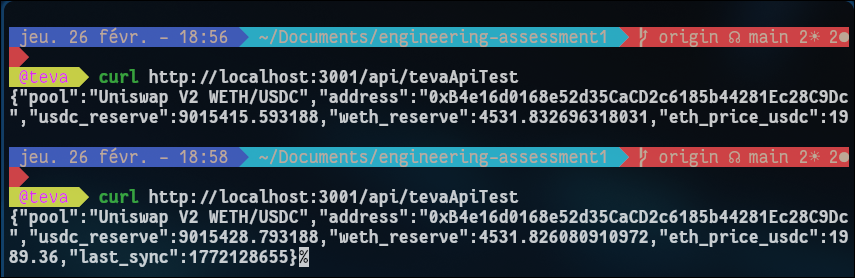
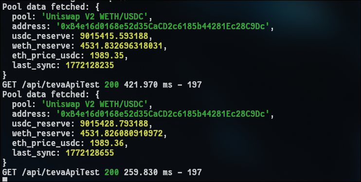

# Engineering Assessment - Teva Andre

## API Endpoint

`GET /api/tevaApiTest`

Fetches Uniswap V2 WETH/USDC pool reserves and computes ETH spot price on-pool.

## Setup

```bash
npm install
npm run dev
```

## Test

```bash
curl http://localhost:3001/api/tevaApiTest
```

## Response

```json
{
  "pool": "Uniswap V2 WETH/USDC",
  "address": "0xB4e16d0168e52d35CaCD2c6185b44281Ec28C9Dc",
  "usdc_reserve": 9015451.504319,
  "weth_reserve": 4531.814698888454,
  "eth_price_usdc": 1989.37,
  "last_sync": 1772129087
}
```

### curl response



### Backend console


